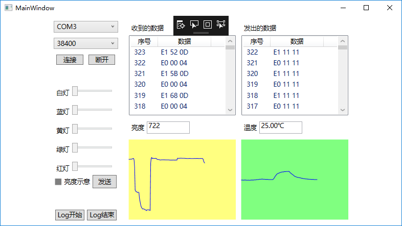

# 实验4：C# .NET 综合应用程序开发
## 功能概述
- 连接Arduino并通过MIDI协议进行通信
- 不断从Arduino获取温度光强数据
- 设定Arduino上LED的亮度
## 项目特色
- 控件布局可随窗口大小变化自动调整
- 程序自动获取可用的串口，并可设置波特率
- PC与Arduino的通信会显示在界面中，并可以记录log文件（.json）
- 从Arduino获取的温度光强可绘制折线图
## 代码总量
296行
## 工作时间
约两天
## 结论
Arduino与PC之间可以通过MIDI协议正常通信交换数据，并完成数据的可视化呈现。

运行截图

